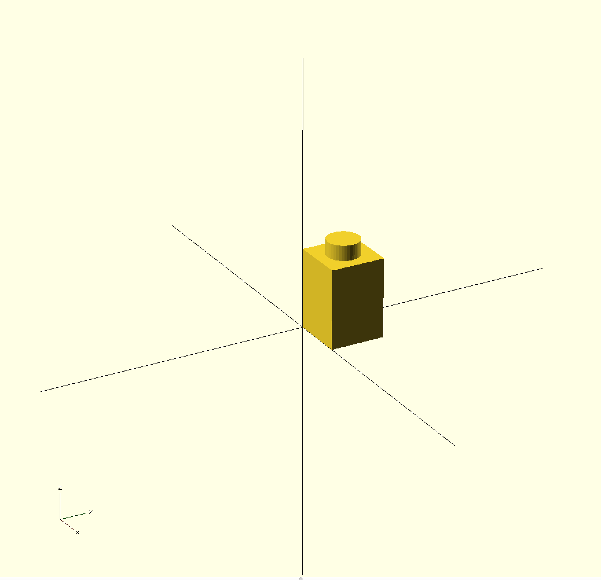
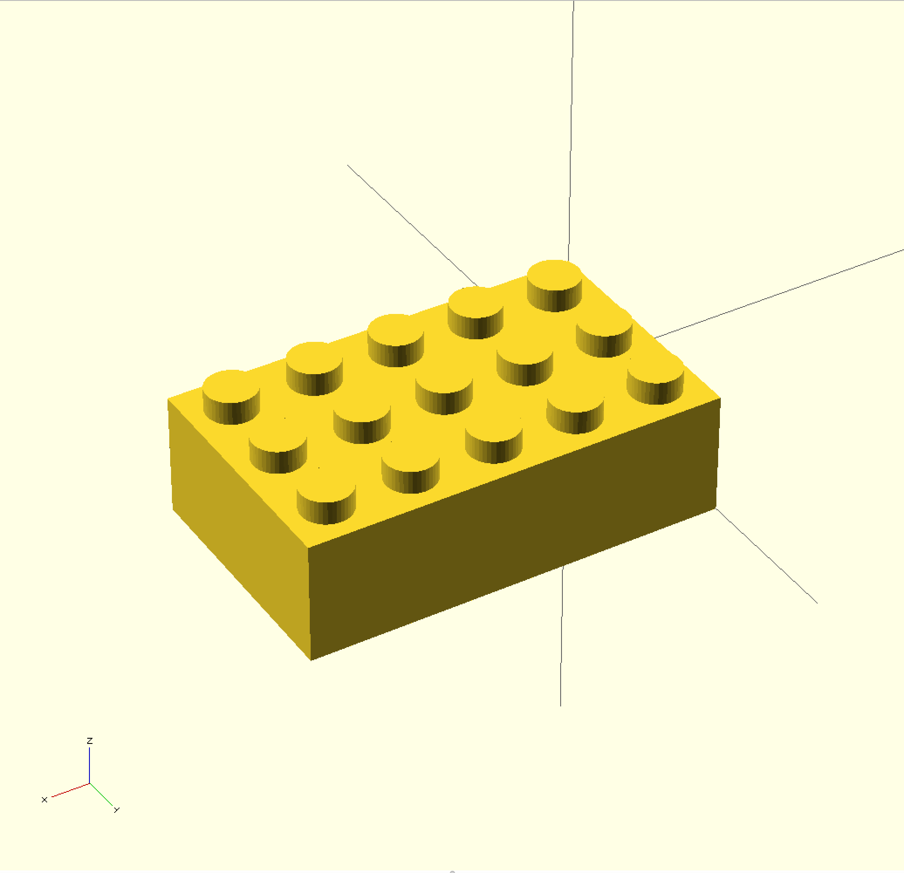
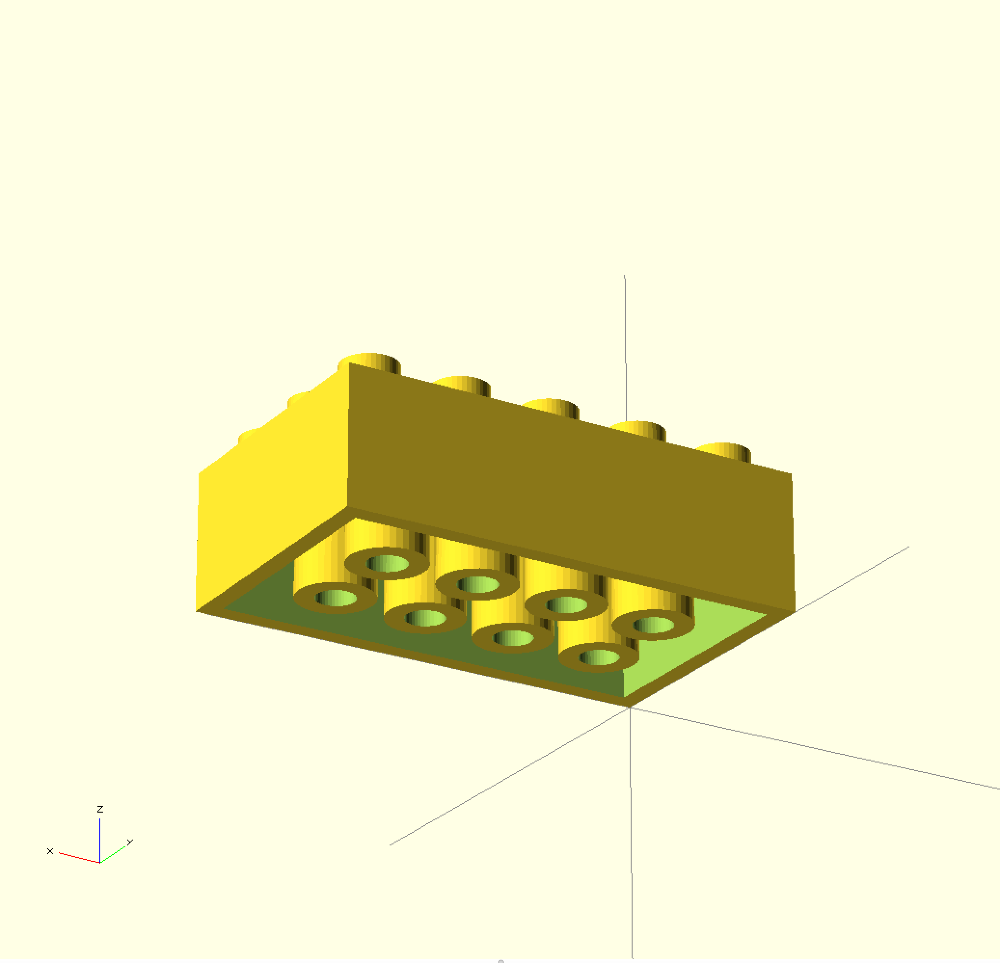
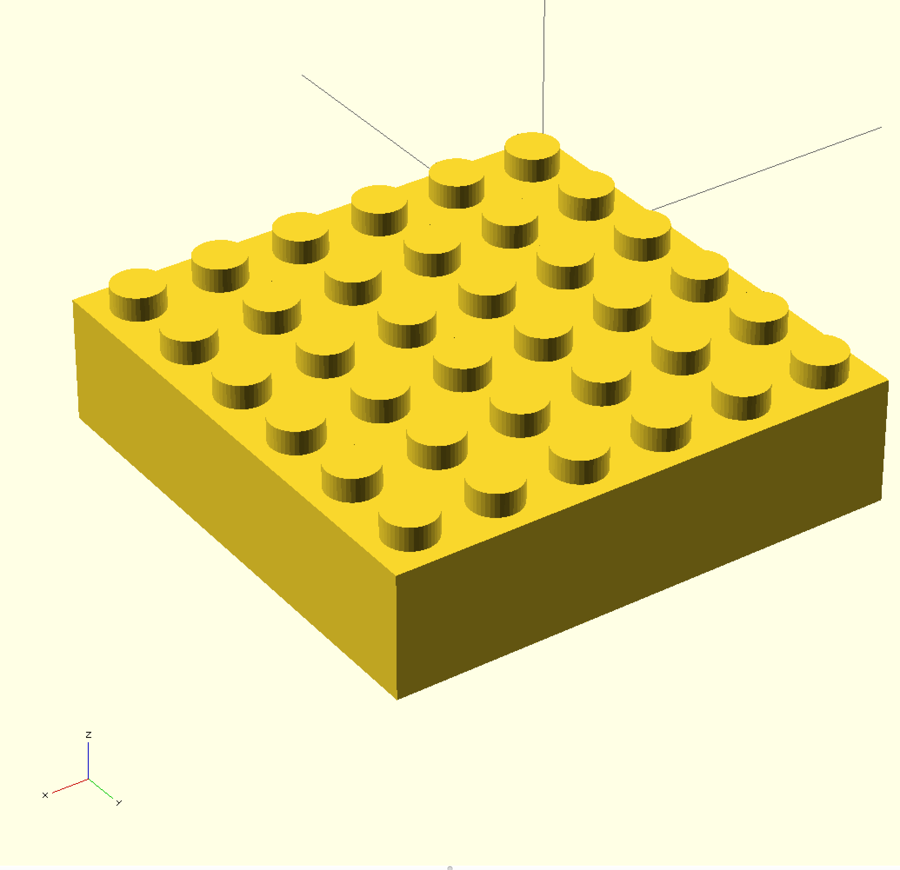
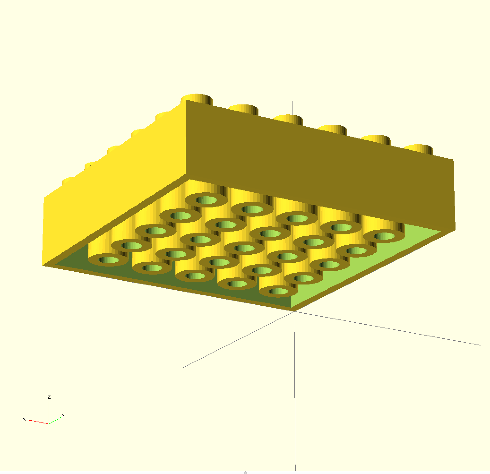

toybrick()
----------

[OpenSCAD](http://openscad.org) program to generate toy bricks compatible with many popular toy brick systems that I cannot name here.

The resulting models can be made real through 3D printers or CNC machines.

This is an example of how to use OpenSCAD. That's all.

### Intro to OpenSCAD

Before you begin, learn the 4 important concepts in my quick deck:

#### [Programming 3D Objects with OpenSCAD](https://speakerdeck.com/joewalnes/programming-3d-object)

Ok, done that? Onwards.

### What is this?

This is a very simple 3D library that has one function:

```scad
toybrick(length, width);
```

It outputs a 3D model.

### Examples

> Pssst! Did you know GitHub has an **[interactive 3D viewer](examples/toybrick-4x2.stl)**? Mind. Blown.

| Code                                                   | Top                                               | Bottom                                               |
|:------------------------------------------------------:|:-------------------------------------------------:|:----------------------------------------------------:|
| `toybrick(1,1)`  [3D viewer](examples/toybrick-1x1.stl)   |    |    |
| `toybrick(4,2)`  [3D viewer](examples/toybrick-4x2.stl)   |    |    |
| `toybrick(5,3)`  [3D viewer](examples/toybrick-5x3.stl)   |    |    |
| `toybrick(6,6)`  [3D viewer](examples/toybrick-6x6.stl)   |    |    |
| `toybrick(10,2)` [3D viewer](examples/toybrick-10x2.stl)  |  |  |

### Implementation

Woah there. If you skipped the [Programming 3D Objects with OpenSCAD](https://speakerdeck.com/joewalnes/programming-3d-object) deck, go back. It's really short. You need to understand the 4 fundamental concepts first.

##### High level

A toy brick consists of:
* a **body** (main hollow brick)
* `n × m` **top studs**
* `(n-1) × (m-1)` **inner tubes**

That's it.

> Note: The variables used for dimensions are defined in [toybrick-dimensions.scad](toybrick-dimensions.scad)

##### Body

Well this is easy. Take a block (scad `cube()`), then hollow it out by calling `difference()` on another block:

```scad
module body(units_wide, units_long) {
	difference() {
		cube([
				units_wide * length,
				units_long * length,
				height]);
		translate([wall_thickness, wall_thickness, 0]) {
			cube([
					units_wide * length - wall_thickness * 2,
					units_long * length - wall_thickness * 2,
					height - wall_thickness]);
		}
	}
}
```

##### Stud

Even easier, it's just a `cylinder()` translated to the right place on top of a block:

```scad
module stud(unit_x, unit_y) {
	translate([
			(unit_x + 0.5) * length,
			(unit_y + 0.5) * length,
			height]) {
		cylinder(d=stud_diameter, h=stud_height);
	}
}
```

##### Inner tube

Another `cylinder()`, hollowed out using the `difference()` of an inner `cylinder()`:

```scad
module tube(unit_x, unit_y) {
	translate([
			unit_x * length,
			unit_y * length,
			0]) {
		difference() {
			cylinder(d=tube_diameter, h=height - wall_thickness);
			cylinder(d=tube_diameter - wall_thickness * 2, h=height - wall_thickness);
		}
	}
}
```

##### Bringing it all together

Now we call our smaller modules to create the `body()`, and a `for` loop to add the `stud()s` and `tube()s`:

```scad
module toybrick(units_wide, units_long) {

	// Step 1: Make the body (main hollow brick)
	body(units_wide, units_long);

	// Step 2: Now loop over x,y...
	for (x=[0 : units_wide - 1], y=[0 : units_long - 1]) {

		// Top stud
		stud(x, y);

		// If beyond the first column and row, inner tube
		if (x > 0 && y > 0) {
			tube(x, y);
		}

	}

	// That's it!
}
```

#### The final code:

* [toybrick.scad](toybrick.scad)
* [toybrick-dimensions.scad](toybrick-dimensions.scad)
* [example1.scad](example1.scad) (standalone example)


